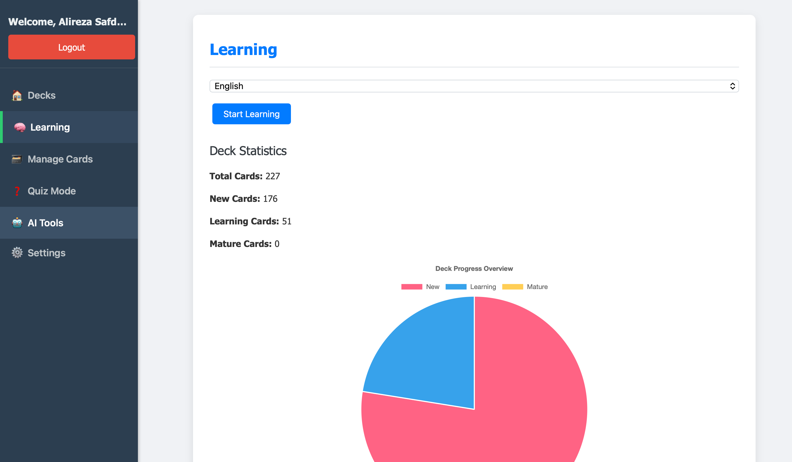

# FlashCard App

This is a web-based flashcard application built with Flask. It allows users to create decks of flashcards, add cards to them, and then review them using a spaced repetition system. The application also integrates with Google's Generative AI to automatically generate flashcards from a given topic or a PDF file.



## Features

*   Create and manage decks of flashcards.
*   Add, edit, and delete flashcards.
*   Review flashcards using a spaced repetition algorithm.
*   Quiz mode with multiple-choice or long-answer questions.
*   Generate flashcards from a topic or a PDF file using Google's Generative AI.
*   User authentication with Google OAuth.

## Project Structure

```
/
├── app.py              # Main Flask application
├── cards.json          # Stores the flashcards
├── decks.json          # Stores the decks
├── config.json         # Stores the application configuration
├── requirements.txt    # Python dependencies
├── static/             # Static files (CSS, JavaScript)
└── templates/          # HTML templates
```

## Installation

1.  Clone the repository:
    ```bash
    git clone https://github.com/your-username/flashcard-app.git
    ```
2.  Install the dependencies:
    ```bash
    pip install -r requirements.txt
    ```
3.  (Optional) Configure Google OAuth and Gemini API:
    *   Create a `config.json` file in the root directory.
    *   Add your Google Client ID, Google Client Secret, and Gemini API key to the `config.json` file:
        ```json
        {
            "GOOGLE_CLIENT_ID": "your-google-client-id",
            "GOOGLE_CLIENT_SECRET": "your-google-client-secret",
            "gemini_api_key": "your-gemini-api-key"
        }
        ```

## Usage

1.  Run the application:
    ```bash
    python app.py
    ```
2.  Open your browser and navigate to `http://localhost:5001`.

## Contributing

Pull requests are welcome. For major changes, please open an issue first to discuss what you would like to change.
